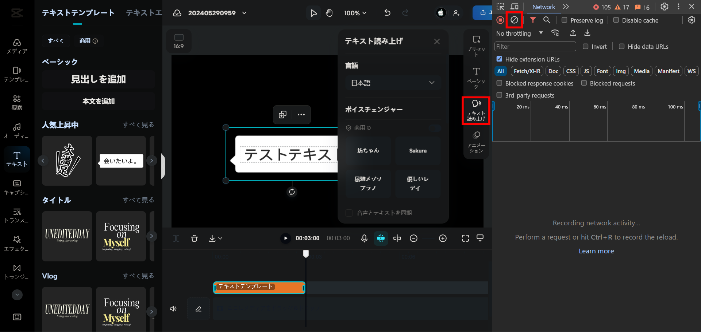
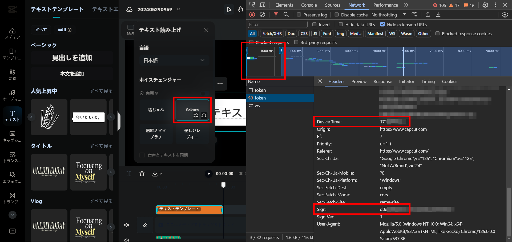

# CapCut TTS Wrapper API

[日本語 README](./README.md)

A self-hosted wrapper API that makes CapCut TTS easier to use through a simple HTTP interface.

With this project, you can keep CapCut-side token refresh logic on the server and fetch generated audio through `GET /v1/synthesize`.

## What You Can Do

- Use CapCut TTS through a simple HTTP API
- Choose between `buffer` and `stream` response modes
- Automatically fetch and refresh tokens
- Run and maintain the server with a TypeScript + Express 5 codebase

## Notes

- This project is not an official CapCut SDK or official API wrapper
- It may stop working at any time if CapCut changes its internal behavior
- Please decide how to publish and operate it at your own risk

## Quick Start

### 1. Install dependencies

```bash
npm install
```

### 2. Create `.env`

macOS / Linux:

```bash
cp .env.example .env
```

Windows PowerShell:

```powershell
Copy-Item .env.example .env
```

### 3. Set `DEVICE_TIME` and `SIGN`

At minimum, add these two values to `.env`:

```env
DEVICE_TIME=
SIGN=
```

### 4. Start the development server

```bash
npm run dev
```

Default listen address:

- `http://0.0.0.0:8080`
- Example access URL from a client: `http://localhost:8080`

### 5. Call the API

```bash
curl "http://localhost:8080/v1/synthesize?text=Hello&type=0&pitch=10&speed=10&volume=10&method=buffer" --output voice.wav
```

## How to Get `DEVICE_TIME` and `SIGN`

You need to extract these values from your browser DevTools while logged in to CapCut.

### Steps

1. Log in to CapCut and create a new empty project
2. Add any text and open the text-to-speech tab
3. Open DevTools, go to Network, and click `Clear Network log`
4. Generate speech with any voice
5. Find the `POST` request related to `token`
6. Copy `Device-Time` and `Sign` from the request headers into `.env`

If there are too many requests, filtering the Network tab with `token` usually helps.

### Reference Images

CapCut screen where TTS is generated:



Example of finding the target request in Network:



## API

### Base URL

```text
http://<host>:<port>/v1/
```

### Endpoint

```http
GET /v1/synthesize
```

### Query Parameters

| Parameter | Type | Required | Description | Default |
| --- | --- | --- | --- | --- |
| `text` | string | Yes | Text to synthesize | None |
| `type` | number | No | Voice type | `0` |
| `pitch` | number | No | Pitch | `10` |
| `speed` | number | No | Speed | `10` |
| `volume` | number | No | Volume | `10` |
| `method` | string | No | `buffer` or `stream` | `buffer` |

### Request Example

```http
GET http://localhost:8080/v1/synthesize?text=Hello&type=0&pitch=10&speed=10&volume=10&method=buffer
```

### Responses

| Status Code | Description |
| --- | --- |
| `200 OK` | Returns `audio/wav` |
| `400 Bad Request` | Invalid query parameters |
| `502 Bad Gateway` | CapCut-side synthesis failed |
| `503 Service Unavailable` | Token is not ready yet |

With `method=buffer`, the whole audio file is returned at once.  
With `method=stream`, audio data is returned progressively as a stream.

See [openapi.yaml](./openapi.yaml) for the OpenAPI definition.

## Voice Type List

| type | Voice name | Speaker ID |
| --- | --- | --- |
| 0 | Mystery Boy 1 | `BV525_streaming` |
| 1 | Mystery Kid | `BV528_streaming` |
| 2 | Cute Voice | `BV017_streaming` |
| 3 | Lady / Sister | `BV016_streaming` |
| 4 | Young Girl | `BV023_streaming` |
| 5 | Girl | `BV024_streaming` |
| 6 | Boy 2 | `BV018_streaming` |
| 7 | Young Master | `BV523_streaming` |
| 8 | Girl | `BV521_streaming` |
| 9 | Female Announcer | `BV522_streaming` |
| 10 | Male Announcer | `BV524_streaming` |
| 11 | Energetic Loli | `BV520_streaming` |
| 12 | Bright Honey | `VOV401_bytesing3_kangkangwuqu` |
| 13 | Gentle Lady | `VOV402_bytesing3_oh` |
| 14 | Elegant Mezzo-Soprano | `VOV402_bytesing3_aidelizan` |
| 15 | Sakura | `jp_005` |
| Unspecified / Other | Lady / Sister | `BV016_streaming` |

## Environment Variables

Main environment variables:

| Variable | Description | Example |
| --- | --- | --- |
| `CAPCUT_API_URL` | CapCut token endpoint | `https://edit-api-sg.capcut.com/lv/v1` |
| `BYTEINTL_API_URL` | Base WebSocket endpoint | `wss://sami-sg1.byteintlapi.com/internal/api/v1` |
| `DEVICE_TIME` | Value captured from CapCut request headers | Required |
| `SIGN` | Value captured from CapCut request headers | Required |
| `USER_AGENT` | User-Agent used for token requests | Chrome-like UA |
| `HOST` | Server listen host | `0.0.0.0` |
| `PORT` | Server listen port | `8080` |
| `CORS_POLICY_ORIGIN` | Allowed CORS origin | `*` |
| `ORIGIN` | Legacy compatibility origin setting | `*` |
| `TOKEN_INTERVAL` | Token refresh interval in hours | `6` |

## npm Scripts

| Command | Description |
| --- | --- |
| `npm run dev` | Start the dev server with `tsx watch` |
| `npm run typecheck` | Run TypeScript type checking |
| `npm run lint` | Lint `src/**/*.ts` with ESLint |
| `npm run lint:fix` | Apply ESLint auto-fixes |
| `npm run build` | Build into `dist/` |
| `npm run start` | Start the built app |
| `npm run test` | Run `build` and then `start` |

## Directory Layout

```text
.
├─ src/
│  ├─ api/
│  ├─ configs/
│  ├─ middleware/
│  ├─ routes/
│  │  └─ v1/
│  │     └─ synthesize/
│  ├─ schemas/
│  ├─ services/
│  ├─ types/
│  └─ utils/
├─ images/
├─ openapi.yaml
├─ package.json
└─ tsconfig.json
```

## Additional Notes

- The server tries to fetch a token at startup, then refreshes it every `TOKEN_INTERVAL` hours
- The current structure prefers `CORS_POLICY_ORIGIN`
- `ORIGIN` is still supported for backward compatibility
